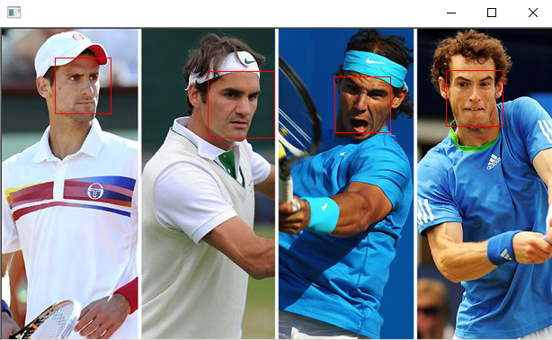

# Face_Detection_Dlib
only use dlib library to detect faces

 ## Dependencies (libraries)
  * openCV
  * dlib
  
 ## Environment
  * Windows 10
  * Anaconda 3
  * Python 3.6
  * GPU accelerating : cuda 10.1 + cudnn v7.5.1
  
 Environment tutorial in : https://github.com/mike98465/Face_Recognition
 
 ## Run 
        python face_detection_dlib.py
 
 ## Result
    
 
        
